# SWPCS User Manual

Welfare Inventory & Distribution Management System  
Southern Province · Working draft · 1 October 2026

This guide explains the screens and day-to-day workflows for Administrators, Subject Officers, Store Keepers, and Social Service Officers (SSOs). Screen images show the local training installation; counts and records will differ in normal use. All four roles were checked in the running application. The direct-aid request, Administrator approval, and SSO distribution cycle was completed using a clearly labelled training record on 2 October 2026.

## Contents

1. [Getting started](#1-getting-started)
2. [Using the dashboard](#2-using-the-dashboard)
3. [Administrator](#3-administrator)
4. [Subject Officer](#4-subject-officer)
5. [Store Keeper](#5-store-keeper)
6. [Social Service Officer](#6-social-service-officer)
7. [Vision camp: complete workflow](#7-vision-camp-complete-workflow)
8. [Statuses, notifications, and reports](#8-statuses-notifications-and-reports)
9. [Common problems](#9-common-problems)

## 1. Getting started

### Sign in

1. Open the SWPCS website provided by your office. On the local installation used for this guide, the sign-in page is `http://localhost/WIDMS-proj/WIDMS/public/login.php`.
2. Select Sinhala, English, or Tamil at the upper left if needed.
3. Enter your **Username** and **Password**. Use the eye icon only when you need to check the password you typed.
4. Select **Sign In**. SWPCS opens the dashboard for your assigned role.

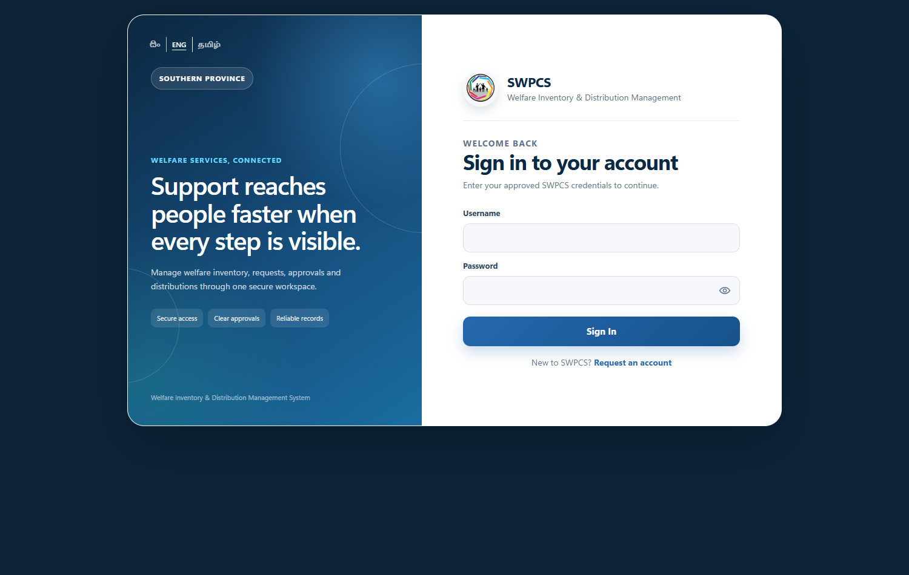

Do not share your password. If access is refused, check that the account has been approved and is still active. Ask an Administrator to check the account rather than creating a second one.

### Request an account

1. On the sign-in page, select **Request an account**.
2. Enter your full name, salary number, email address, mobile number, and a password of at least eight characters. Confirm the password.
3. Select the role assigned by your office. If the form asks for a district and DS Division, select your actual assignment.
4. Select **Send request**. Wait for an Administrator to approve it before signing in.

For new salary-number accounts, the username is `swpcs` followed by the salary number, including any leading zeros. For example, salary number `00123` gives username `swpcs00123`. The account approval SMS is sent to the mobile number on the request when messaging is configured. Older accounts may still use their original email-based username.

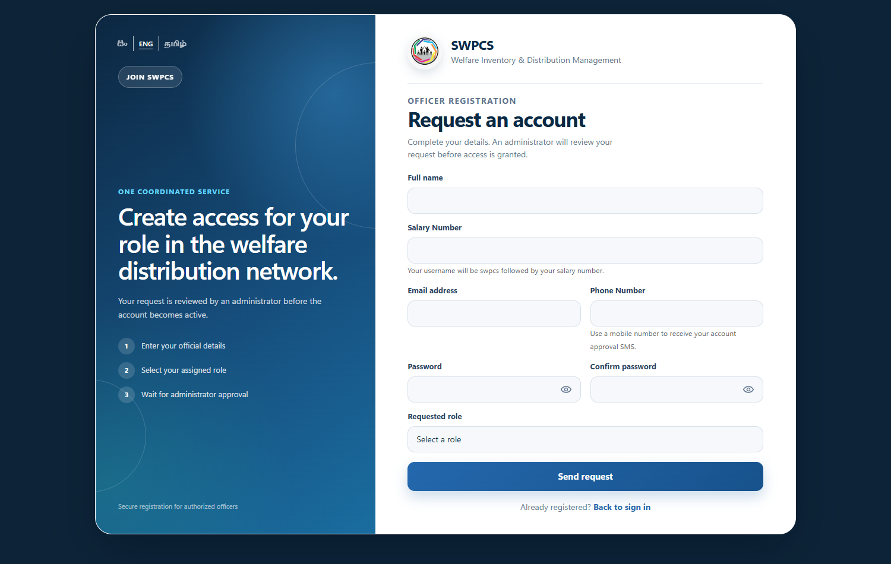

### Your profile and sign-out

Select your profile in the sidebar to review your contact details, change your photo, or update your password. A password change requires your current password. Select **Sign Out** when you finish, particularly on a shared computer.

## 2. Using the dashboard

The left sidebar groups pages by task. The top bar contains a search box and a notification bell. Use the menu button when the sidebar is collapsed. Some pages have their own **Search** box and filters; these search the current table, not the whole system.

The bell lists alerts that need attention or report a completed decision. Select an alert to open its related page. Pending-action alerts disappear from the bell when the action has already been completed elsewhere; this does not remove the record from its table or history page. Sidebar numbers on approval queues show how many requests remain pending.

When a form reports an error, correct the indicated field and submit again. Do not repeatedly click a submit button: the system protects against duplicate submissions. A successful request generally moves from a pending page into its history page.

### Who does what?

| Role | Main responsibility | Common hand-off |
| --- | --- | --- |
| Administrator | Approves accounts, aid, quotas, corrections, and vision camp requests; supervises records | Approved stock goes to the Store Keeper for release |
| Subject Officer | Requests aid and quotas, manages vision camps, records final distributions | May hand released aid to the assigned SSO |
| Store Keeper | Receives supplier goods, maintains central/camp stock, releases approved requests | Released goods go to the requesting officer |
| Social Service Officer | Manages assigned DS Division pool and distributes approved aid | Records beneficiary distribution and returns |

## 3. Administrator

### Dashboard

The Administrator dashboard shows central stock, pending approvals, active SSOs, and recent distribution totals. **Pending Actions** cards open the corresponding approval queues. Counts are live examples, not fixed targets.

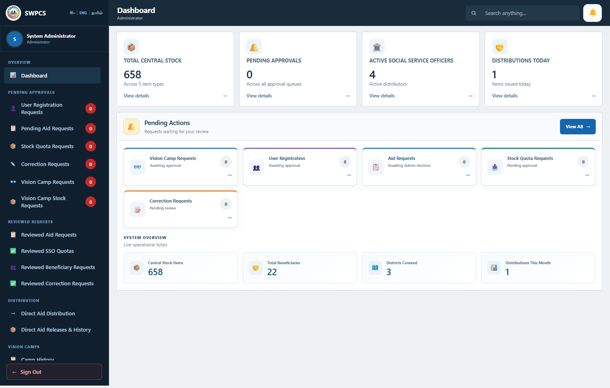

### Review a new user account

1. Open **Pending Approvals → User Registration Requests**.
2. Open the request card and check the person's name, salary number, role, contact details, and assigned district/DS Division.
3. Select **Approve** to create the active account. To decline, enter an Administrator note and select **Reject**; a reason is required.
4. Review the resulting account under **User Management → Users**.

Only one active SSO can be assigned to a particular DS Division. If one already exists, resolve that assignment before approving or reactivating another SSO for the same division.

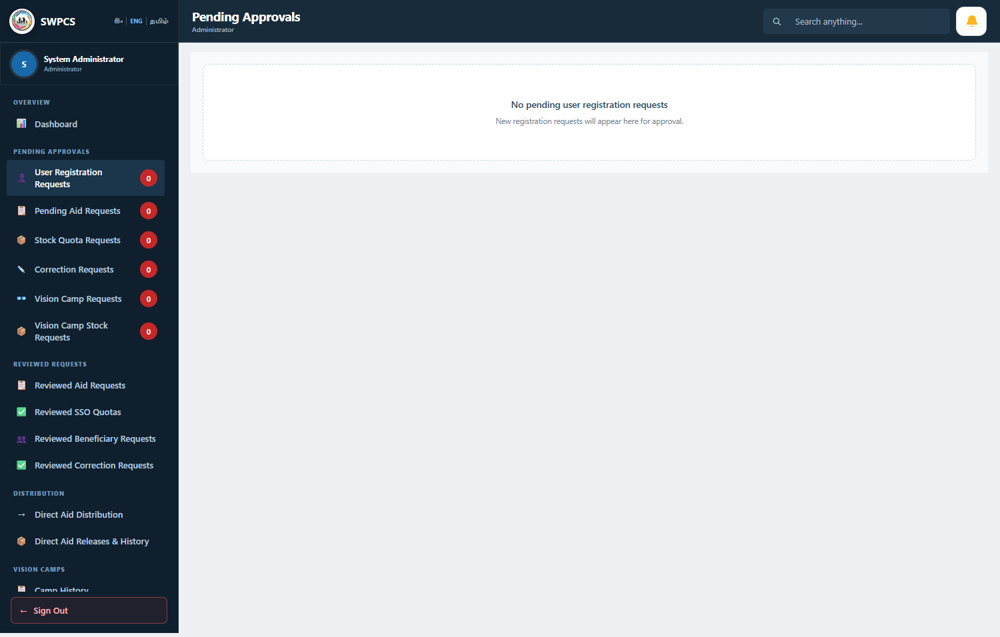

### Review aid and stock requests

Use **Pending Aid Requests** to inspect the beneficiary, requested item, supporting information, and official approval indicators before choosing **Approve** or **Reject**. Rejection requires a reason. Approved aid then follows the relevant stock and distribution route; approving the aid request alone does not record delivery to the beneficiary.

Use **Stock Quota Requests** to review the entire requested batch, destination division, recipient officer, quantities, and central stock availability. Approval reserves stock for the batch. The Store Keeper must still release it. Rejected requests move to the reviewed history with the reason.

Use **Correction Requests** to compare the original record and requested correction. **Approve & Apply** updates the record; **Reject** requires a reason and leaves the original record unchanged. Reviewed requests are available under **Reviewed Requests**.

### Review vision camps

1. Open **Vision Camp Requests** and approve or reject each proposed camp. A rejection needs a reason.
2. After a Subject Officer conducts a camp, registers participants, and requests camp stock, open **Vision Camp Stock Requests**.
3. Check the camp, selected spectacle quantities, and planned distribution date, time, and place before deciding.
4. Approved camp stock goes to the Store Keeper's **Camp Release Requests** queue. Approval is not the same as release.

The **Camp History** page shows camp status, stock request status, distribution progress, dates, and registered participants. Use its search and filters to find a camp.

### Direct aid and administration

The **Direct Aid Distribution** area handles Administrator-entered direct beneficiary aid requests and distributions. **Direct Aid Releases & History** shows items awaiting Store Keeper release, ready for Administrator handover, and completed direct distributions. Follow the status shown on the row; do not mark aid distributed before physical handover.

Under **Users**, use Search, Status, and Role filters. **+ Add User** creates an active account. **Suspend** requires a reason; the status table shows the suspension date and time. Reactivation is available only where the account and division rules allow it. Under **Divisions**, review active SSO assignments by district and DS Division.

When creating an SSO account, the **District** and **DS Division** fields appear in the Add User dialog. A division already occupied by an active SSO cannot be selected. Do not enter a real password when demonstrating this form for training.

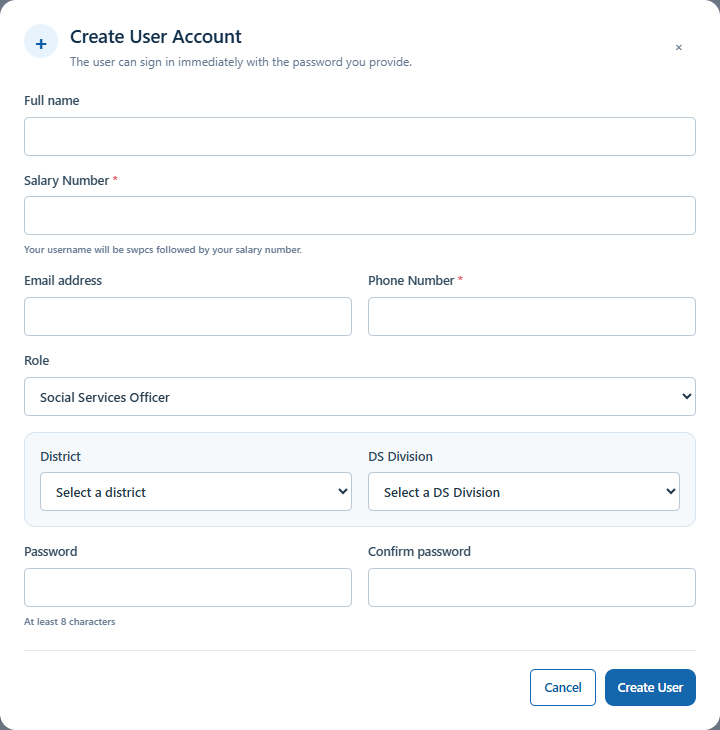

Under **Stock & Payments**, review central stock, DS Division pools, and supplier payment history. Under **Suppliers**, register companies, allocate authorized aid items, and review balances. Use **System Config** only when authorized to change shared settings.

### Reports and audit

Open **Reports** and choose the required report: Inventory, Distribution, Beneficiary, SSO Pool, Procurement Cost, Request Status, Return & Reuse, or Audit Log. Select **Generate** for the on-screen report, or **PDF**/**CSV** to export. **Recent Activity** and **Audit Log** help trace who performed an action and when.

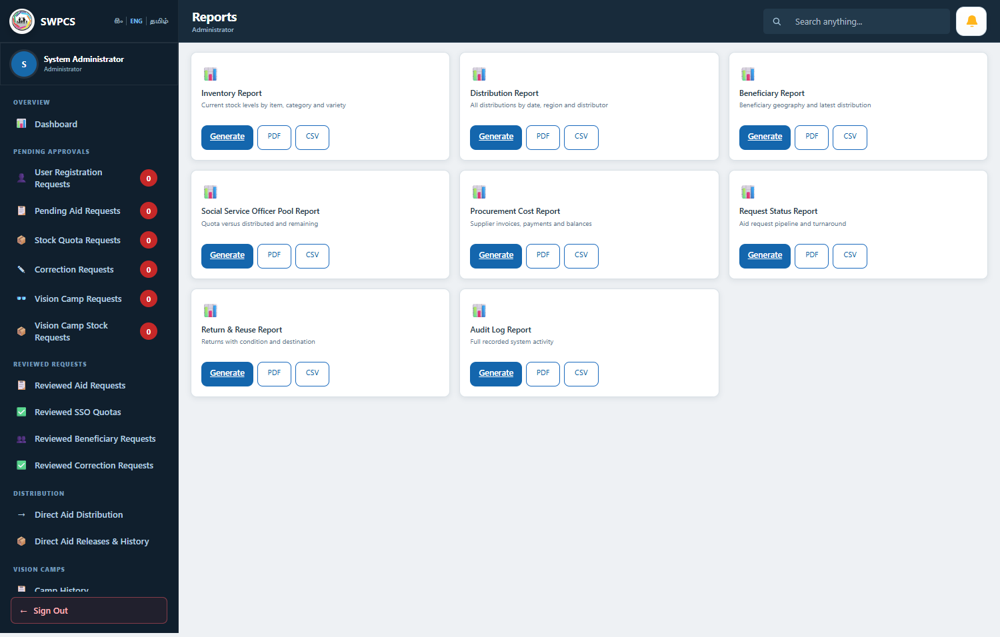

### Administrator screen directory

All 26 Administrator sidebar destinations were opened in the running installation. The queues currently contain no pending requests, so their approval-card instructions above are based on the application workflow rather than a live sample decision.

| Sidebar group | Screens | Use |
| --- | --- | --- |
| Overview | Dashboard | Key figures and links to pending work |
| Pending Approvals | User Registration Requests; Pending Aid Requests; Stock Quota Requests; Correction Requests; Vision Camp Requests; Vision Camp Stock Requests | Review and decide new requests |
| Reviewed Requests | Reviewed Aid Requests; Reviewed SSO Quotas; Reviewed Beneficiary Requests; Reviewed Correction Requests | Find decisions and their history |
| Distribution | Direct Aid Distribution; Direct Aid Releases & History | Administrator direct-aid request, release, and delivery records |
| Vision Camps | Camp History | Search camps, participants, stock, and distribution progress |
| Stock & Payments | Current Stock; DS Division Pools; Payment History | Review inventory, officer pools, invoices, and balances |
| Suppliers | Register & Allocate; Registered Suppliers; Balance Summary | Maintain suppliers and authorized products |
| User Management | Users; Divisions | Manage accounts and SSO division assignments |
| Reports & Activity | Reports; Recent Activity; Audit Log | Export summaries and trace actions |
| System | System Config | Shared configuration and disability types |

## 4. Subject Officer

### Dashboard and navigation

After signing in, the dashboard summarizes submitted quota requests, beneficiaries in the division, pending quota releases, and returns this month. It also shows division pools and needs awaiting goods. Use the left menu to open the relevant workflow; the notification bell and search box are in the top bar.

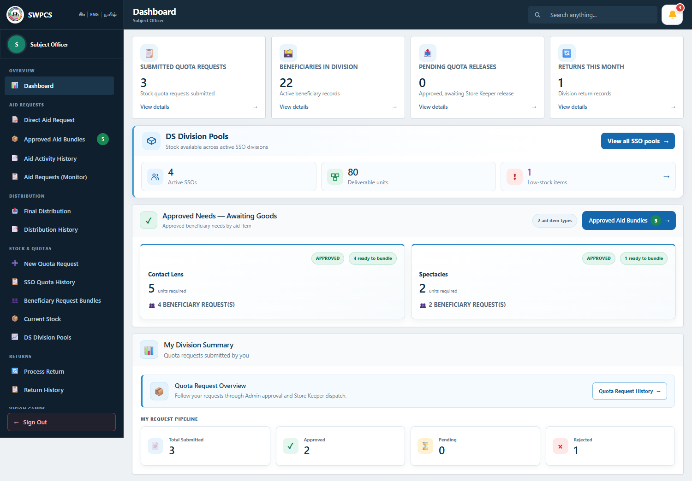

### Aid requests and quotas

Use **Direct Aid Request** to record a beneficiary's details and requested aid, then send it for Administrator review. Check **Aid Activity History** for decisions and **Aid Requests (Monitor)** for the broader request list. After approval, **Approved Aid Bundles** shows eligible requests that can be grouped for stock review where the workflow requires it.

When a division needs additional stock, open **New Quota Request**. Select the district, DS Division, receiving SSO, aid item, quantity, and justification. Add the required quota items and submit the batch for Administrator approval. **SSO Quota History** and **Beneficiary Request Bundles** show the status after submission. The Store Keeper releases an approved batch from central stock; it is not available for delivery before release.

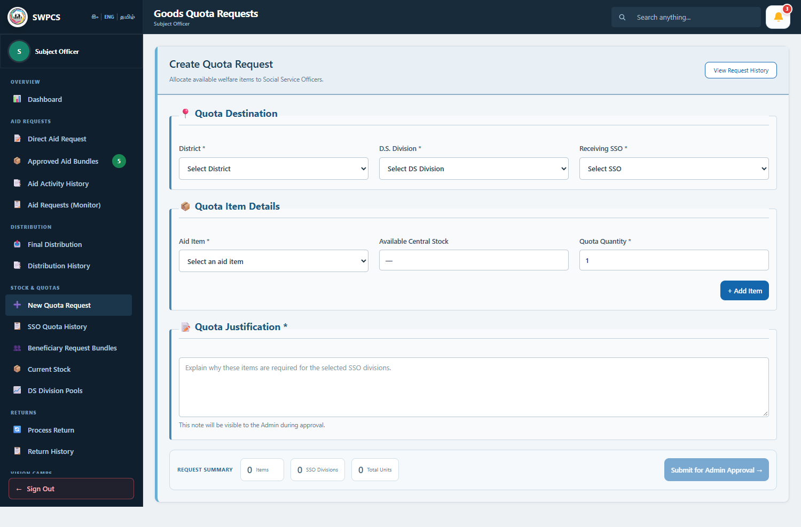

### Final distribution and returns

Open **Final Distribution** for released aid assigned to you. Check the beneficiary and released item. Choose **Distribute to Beneficiary** when you hand over the item, or **Hand to SSO** when the assigned division officer will complete delivery. The completed action appears in **Distribution History**. Use **Process Return** and **Return History** if an issued item comes back.

### Vision camps and configuration

Use **New Vision Camp** to request a camp with its district, DS Division, estimated participants, date, and time. **My Camps** shows camps you requested; **All Vision Camps** is a broader history. The detailed camp sequence is in [Chapter 7](#7-vision-camp-complete-workflow).

The camp time uses separate hour, minute, and AM/PM selectors. Review all three before submitting the request.

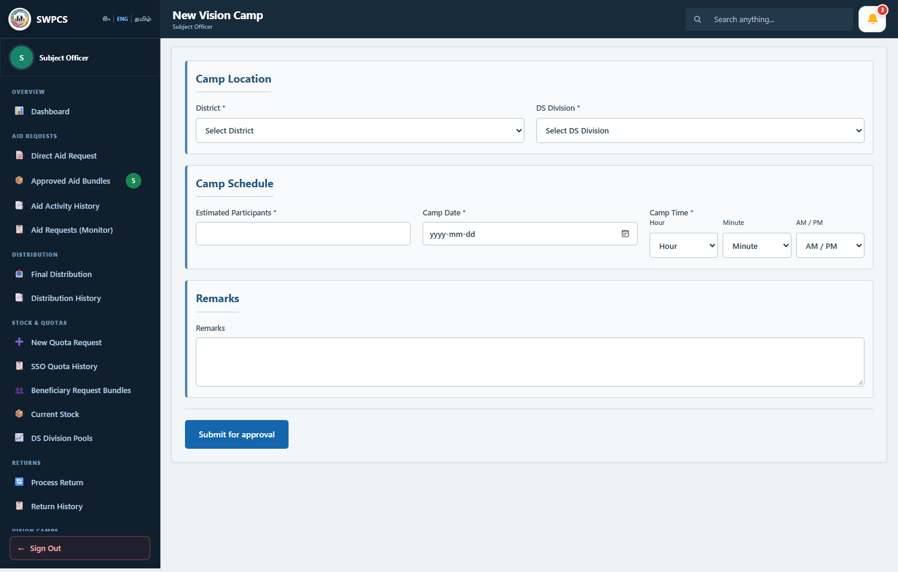

The **Eligibility Rule Builder** controls aid eligibility definitions, waiting periods, and prohibited combinations. Check **Configured Eligibility Rules** before editing a live rule, because changes can affect later beneficiary selections. The supplier pages are also available where the office has assigned that responsibility.

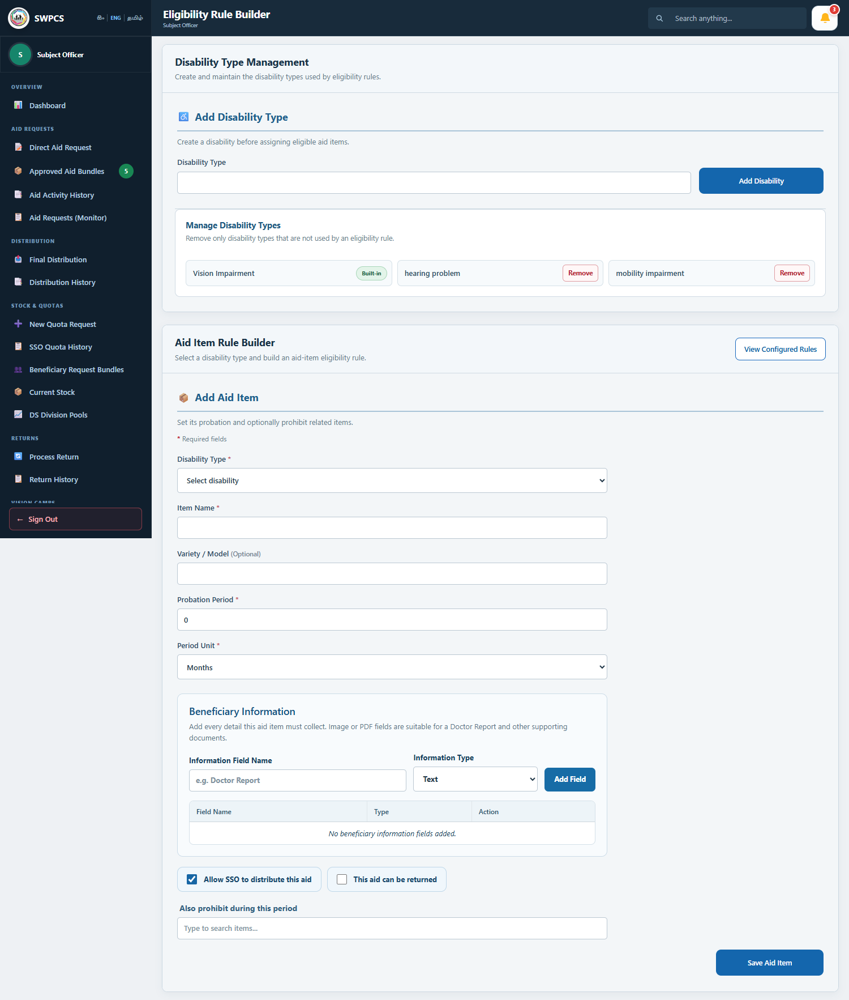

### Subject Officer screen directory

| Menu group | Screens | Main purpose |
| --- | --- | --- |
| Overview | Dashboard | Review workload, stock pools, and pending needs |
| Aid Requests | Direct Aid Request; Approved Aid Bundles; Aid Activity History; Aid Requests (Monitor) | Submit and track beneficiary aid requests |
| Distribution | Final Distribution; Distribution History | Hand over released aid and review completed deliveries |
| Quotas | New Quota Request; SSO Quota History; Beneficiary Request Bundles | Request and follow DS Division stock quotas |
| Stock | Current Stock; DS Division Pools | Review central and division quantities |
| Returns | Process Return; Return History | Record and review returned aid |
| Vision Camps | New Vision Camp; My Camps; All Vision Camps; Request Camp Stock | Plan, conduct, and supply spectacle camps |
| Suppliers | Register & Allocate; Registered Suppliers; Balance Summary | Manage authorized suppliers and allocations |
| Eligibility | Eligibility Rule Builder; Configured Eligibility Rules | Maintain and review aid rules |
| Reports & Activity | Reports; Recent Activity; Audit Log | View summaries and trace actions |

Some pages display actions or cards only when eligible records exist. In the training installation, **Request Camp Stock** had no ready camps during this walkthrough; this guide does not create a request merely to populate that screen.

## 5. Store Keeper

### Dashboard

The dashboard shows pending dispatch requests, central stock units, low-stock alerts, and outstanding payments. Use the stock composition and attention panels to identify what needs checking next.

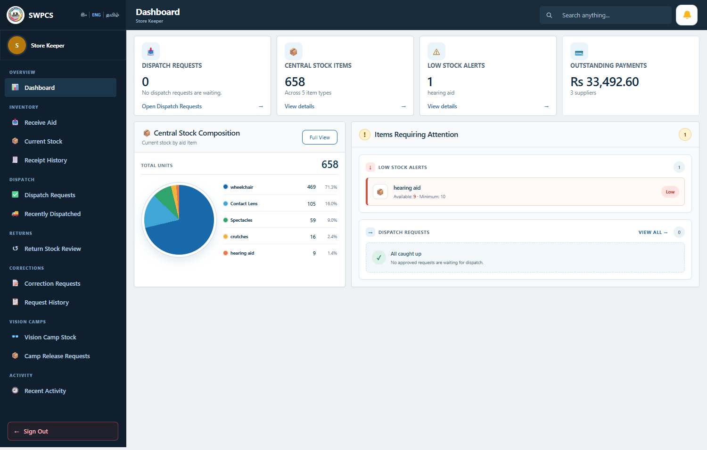

### Receive and check stock

Open **Receive Aid** when a supplier delivers goods. First choose **Stock Destination** (Central Stock or a completed Vision Camp), then the authorized supplier and item. Enter quantity, unit cost, bill/invoice number, date received, and payment status. Review the calculated total cost and balance due before selecting **Record**. Check all values against the physical delivery and invoice before saving. Camp stock is tracked separately from ordinary central stock.

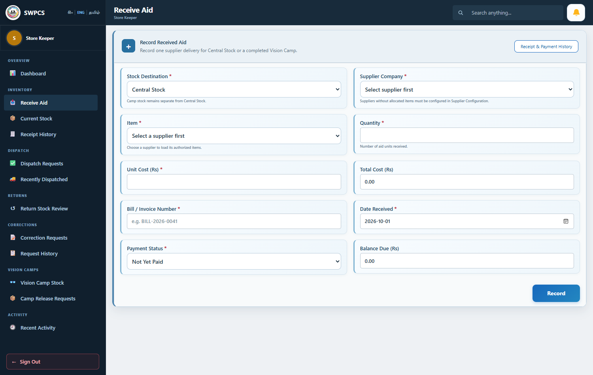

Use **Current Stock** to review quantities and low-stock status. Its stock-status and aid-type filters narrow the table; **View batches** opens receipt details and the payment summary. **Receipt History** tracks supplier batches, invoices, balances, and later payments. Contact Lens stock uses quantities; no lens-power entry is required in this flow.

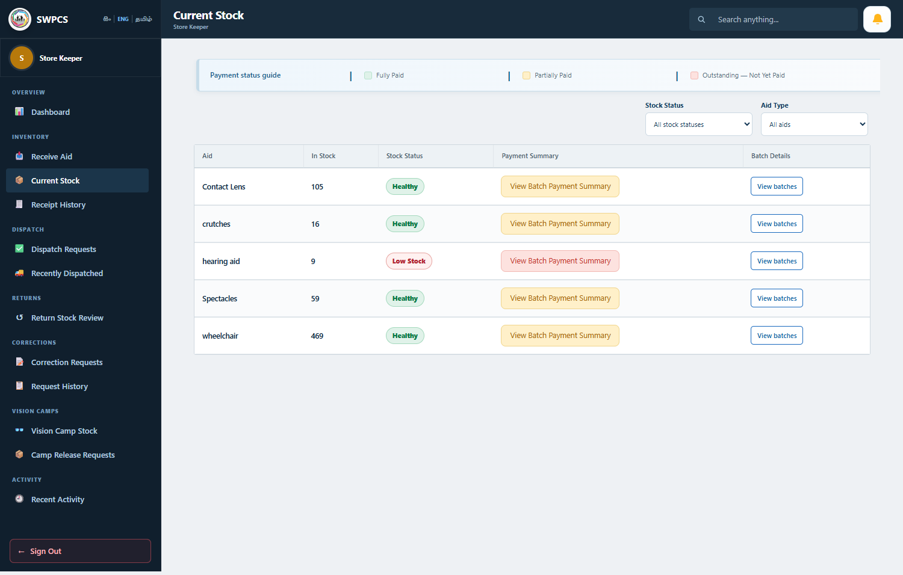

### Release approved goods

Open **Dispatch Requests** to see approved quota batches and any direct aid release awaiting Store Keeper action. Compare the item and quantity with stock on hand, check the intended recipient, and select the release action. A completed release moves to **Recently Dispatched**. Do not release a batch to a different officer than the one shown.

For vision camps, **Vision Camp Stock** lists each camp and its overall stock status, with search, district, and status filters. **Camp Release Requests** contains Admin-approved camp batches; release these to the requesting Subject Officer only after checking the batch. The test account had no pending dispatch or camp-release requests during this walkthrough, so their action controls were not exercised.

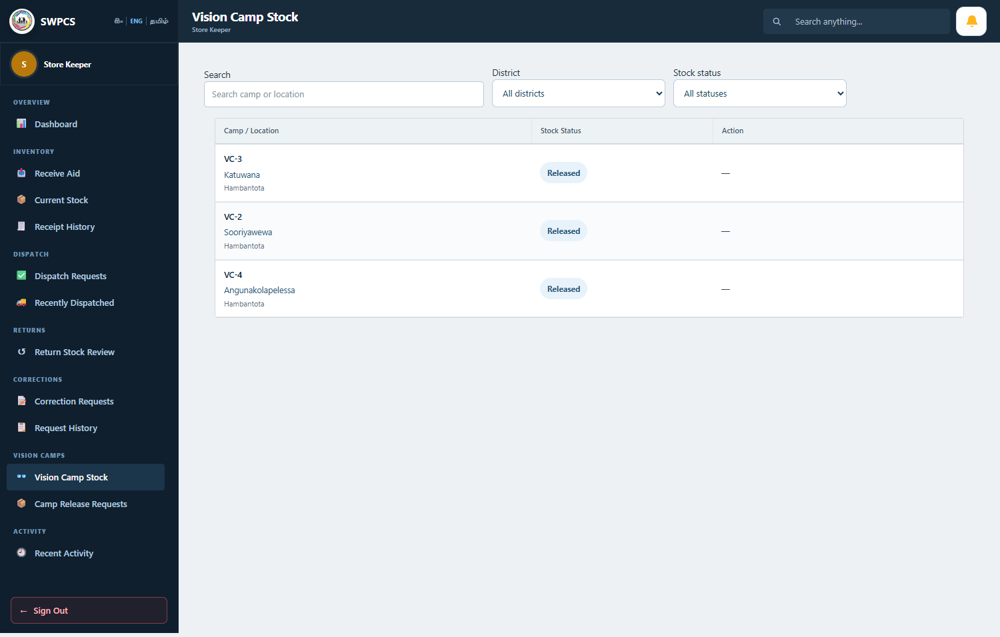

### Returns and corrections

Use **Return Stock Review** to accept or reject good returned items that should go back to central stock. A rejection needs a reason. Use **Correction Requests** when an earlier receipt, payment, or other supported record needs correction; only Administrator approval applies the proposed change. Track the decision in **Request History**.

### Store Keeper screen directory

| Menu group | Screens | Main purpose |
| --- | --- | --- |
| Overview | Dashboard | Review dispatches, stock, alerts, and payments |
| Inventory | Receive Aid; Current Stock; Receipt History | Record and inspect supplier receipts and central stock |
| Dispatch | Dispatch Requests; Recently Dispatched | Release approved requests and review dispatches |
| Returns | Return Stock Review | Review returned stock for central inventory |
| Corrections | Correction Requests; Request History | Propose and track corrections requiring approval |
| Vision Camps | Vision Camp Stock; Camp Release Requests | Review camp stock and release approved camp batches |
| Activity | Recent Activity | Inspect recent Store Keeper actions |

## 6. Social Service Officer

### Dashboard and stock quota

The dashboard summarises remaining pool quota, items distributed today, low-stock alerts, returns, and the division request pipeline. Use **My Pool Quota** to see allocated, distributed, and remaining quantities. Its **Distribute** action opens the eligible request list for that item.

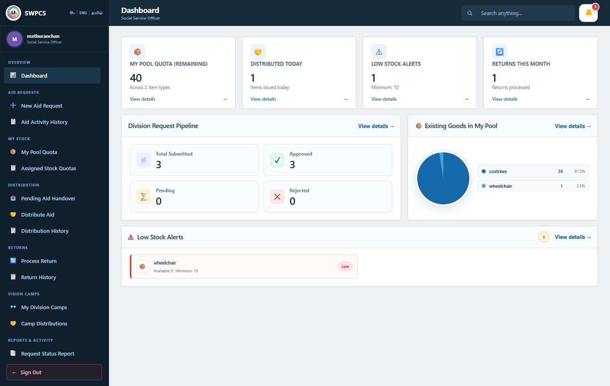

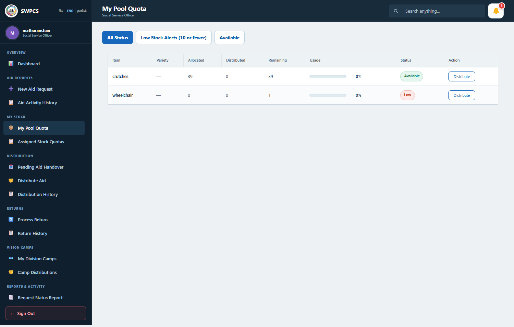

### Request and distribute aid

Use **New Aid Request** to register or select the correct beneficiary and request the required item. The beneficiary must belong to your assigned DS Division. **Aid Activity History** shows the request decision and later progress.

Enter the GN Division, beneficiary details, identification method, date of birth, address, disability, requested aid, quantity, and any notes. All four official-approval boxes must be selected before the request can be submitted. Use **Save as Draft** only when the request needs more information before it goes to the Administrator.

**My Pool Quota** shows stock available in your assigned division pool. **Assigned Stock Quotas** lists allocations made for that pool; it is not the list of beneficiary requests. **Distribute Aid** shows Admin-approved beneficiary requests only when enough pool stock is available. Check the beneficiary, item, and quantity, enter optional notes, and confirm physical handover. The completed record moves to **Distribution History**, where it can be searched and filtered by item and date.

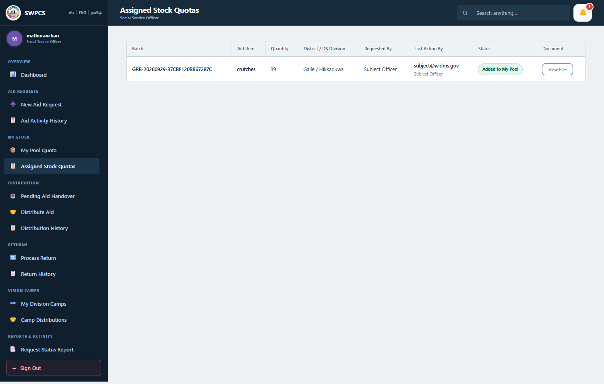

### Verified direct-aid flow

The following cycle was performed in the training installation with request `AR-0029`, a dummy beneficiary record clearly marked **TRAINING ONLY**:

1. The SSO completed **New Aid Request**, including all four official approvals, and submitted it.
2. The request appeared in the Administrator's **Pending Aid Requests** queue with its beneficiary, division, requested item, and approval summary.
3. The Administrator selected **Approve**. The SSO's **Aid Activity History** then showed the request as **Approved**.
4. Because the SSO division pool contained one matching unit, **Distribute Aid** displayed the request with a **Distribute** button.
5. The SSO recorded the handover. The request status became **Distributed** and the pool quantity was reduced accordingly.

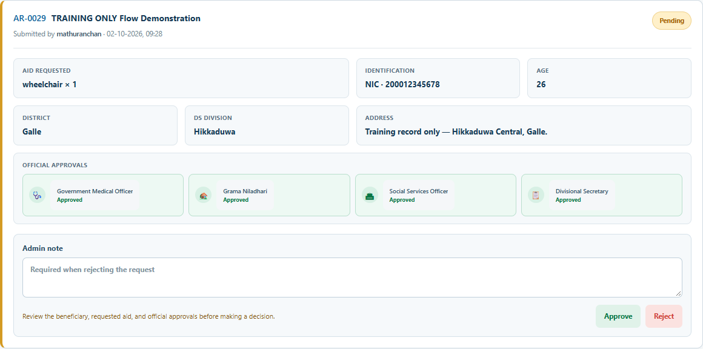

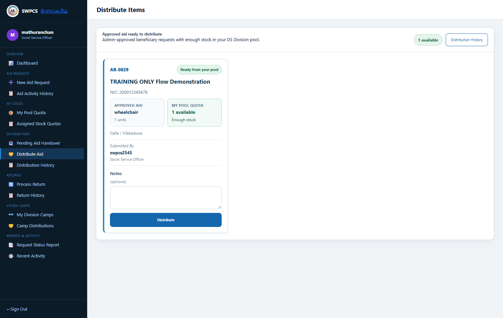

### Rejection workflow

The Administrator can reject a pending aid request from **Pending Aid Requests**. Before selecting **Reject**, enter a clear reason that tells the submitting officer what must be corrected. The request is removed from the approval queue and its SSO history changes to **Rejected** with the recorded reason.

The rejection cycle was also checked with training request `AR-0030`. The Administrator recorded: “documents require correction before approval.” The SSO could then see both the **Rejected** status and that reason in **Aid Activity History**.

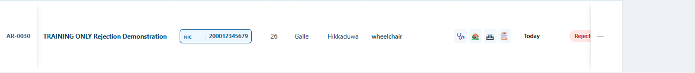

A rejected request cannot be distributed. Review the reason, correct the beneficiary or request information, obtain the required official approvals again where needed, and submit a new request. Do not change a different beneficiary's request to reuse it.

Use **Pending Aid Handover** for items a Subject Officer has passed to you for final delivery. Complete the handover only after the beneficiary receives the item. **Process Return** and **Return History** record returned aid.

### Vision camps

**My Division Camps** shows approved or completed camps in your assigned DS Division. **Camp Distributions** handles follow-up distribution only for camp stock explicitly transferred to you. A camp or participant outside your division cannot be changed through your account.

### SSO screen directory

| Menu group | Screens | Main purpose |
| --- | --- | --- |
| Overview | Dashboard | Review division requests, pool balances, and alerts |
| Aid Requests | New Aid Request; Aid Activity History | Submit and follow beneficiary aid requests |
| My Stock | My Pool Quota; Assigned Stock Quotas | Check division stock and its allocation batches |
| Distribution | Pending Aid Handover; Distribute Aid; Distribution History | Complete direct handovers and review distributions |
| Returns | Process Return; Return History | Record and review returns |
| Vision Camps | My Division Camps; Camp Distributions | View division camps and distributed camp stock |
| Reports & Activity | Request Status Report; Recent Activity | Export request status and inspect recent actions |

## 7. Vision camp: complete workflow

Vision camps are a separate spectacles-only process. Do not use ordinary Central Stock or Contact Lens records to complete a camp stock request.

1. **Request the camp (Subject Officer).** In **New Vision Camp**, choose the location and schedule, then submit. The camp is pending Administrator approval.
2. **Approve the camp (Administrator).** Use **Vision Camp Requests**. The Subject Officer sees the decision in camp history.
3. **Conduct the camp (Subject Officer).** On or after its scheduled date, use the enabled **Conduct Camp** action. Record each participant's identifying details, address, GN Division, spectacle type, and selection decision. Rejections require a reason. Complete registration when all participants have a decision.
4. **Receive supplier spectacles (Store Keeper).** In **Receive Aid**, select the conducted camp and record the supplier receipt. The stock belongs to that camp, not the ordinary central inventory.
5. **Request camp stock (Subject Officer).** The **Request Camp Stock** page shows camps with available spectacle quantities. Set the planned distribution **date, time, and place**, add optional remarks, and submit one batch for Administrator review.
6. **Approve and release.** The Administrator reviews the batch under **Vision Camp Stock Requests**. After approval, the Store Keeper releases it under **Camp Release Requests**. Camp history displays the approval and release status, release date, and planned distribution schedule.
7. **Prepare notices.** Once Admin has approved camp stock, open the camp's **Registered Participants** page. **Edit A5 letter** changes wording shared by that camp; **Print A5 letters** prints one page for each eligible selected participant. Each page automatically uses that person's registration number, name, and postal address. Check the common wording and the approved distribution date, time, and place before printing. **Print with signatures** and **Download Excel** are separate participant-list outputs.
8. **Distribute.** On or after the planned distribution date and time, open **Distribute Spectacles** or the registered-participant page. Each approved, undistributed beneficiary has an individual distribute action while released stock is available. As individual handovers are recorded, camp distribution status moves from **Pending Distribution** to **In Distribution**, then **Distributed** when all approved participants are recorded. A transferred balance may instead be distributed by the assigned SSO.

If a button is disabled, check the scheduled time, approval, release, participant decision, available stock, and role assignment shown on the page. Do not change the computer clock to bypass the schedule.

## 8. Statuses, notifications, and reports

| Status | Meaning | Next step |
| --- | --- | --- |
| Pending / Need Approval | Request submitted but not decided | Administrator reviews it |
| Approved | Administrator accepted the request | Follow the stock or release step shown |
| Rejected | Request declined with a recorded reason | Read the reason; submit a corrected new request if appropriate |
| Awaiting Store Release | Approved goods have not been physically released | Store Keeper checks and releases them |
| Released | Store Keeper handed stock to the responsible officer | Officer records the beneficiary handover at the permitted time |
| Pending Distribution | No approved participant handover recorded yet | Begin distribution when stock and date permit |
| In Distribution | Some, but not all, approved participants have received spectacles | Continue individual handovers |
| Distributed / Completed | The relevant delivery or workflow has been recorded | Review history; do not submit it again |

The exact labels vary by page. A request's table row and its history are the lasting record. The notification bell is a shortcut, not the official proof of approval or distribution.

Action notifications link to the related request, stock, camp, or distribution row. If the required action has already been completed before the notification is opened, the item is removed from the bell count. It remains visible in the relevant table and history page, so completed work is not repeated.

Most history pages provide a local Search field, status filters, or district/DS Division filters. Clear filters if an expected row is missing. Where **Print**, **PDF**, **CSV**, or **Excel** is available, verify the report period and filters before sharing the output. Printed participant lists and letters contain personal information; store and post them securely.

## 9. Common problems

| Problem | What to check |
| --- | --- |
| Cannot sign in | Correct username and password; account approval and active status |
| Request or participant not found | Search text, filters, district/DS Division, and whether the item moved to a history page |
| Approval or release button disabled | Role permissions, current status, stock quantity, and required fields |
| Camp distribution button disabled | Planned distribution date/time, Admin approval, Store Keeper release, selected participant, and remaining stock |
| “Another DS Division” message | Read the district and DS Division shown; use the officer assigned to that beneficiary's division |
| A form will not save | Read the validation message, complete starred fields, and avoid duplicate clicks; reopen the form if its submission token expired |
| SMS or email not received | Confirm the account contact details; use the web status as the source of truth and ask the system operator to check messaging configuration |

For data errors that cannot be corrected through an authorized screen, record the reference number (for example `AR-`, `GR-`, `VC-`, or `RET-`) and contact the appropriate Administrator. Never send passwords, beneficiary identity documents, or full medical details in a general chat message.
